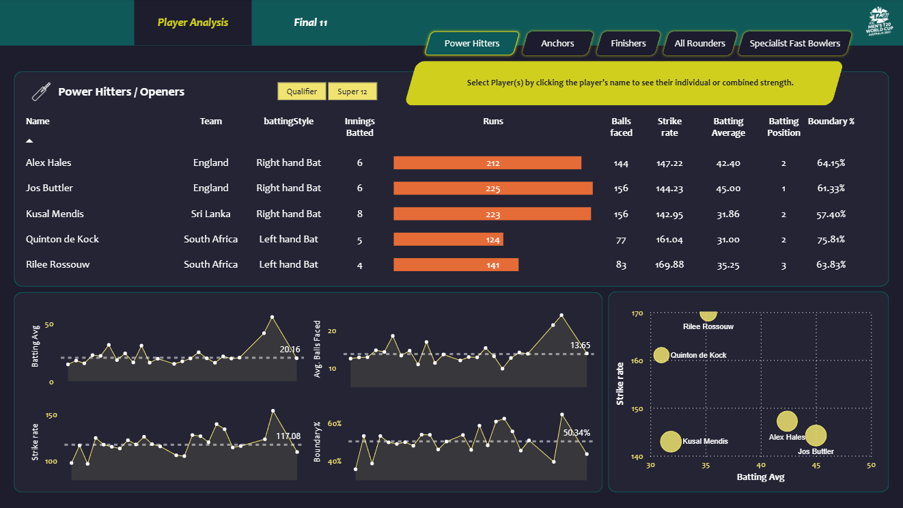
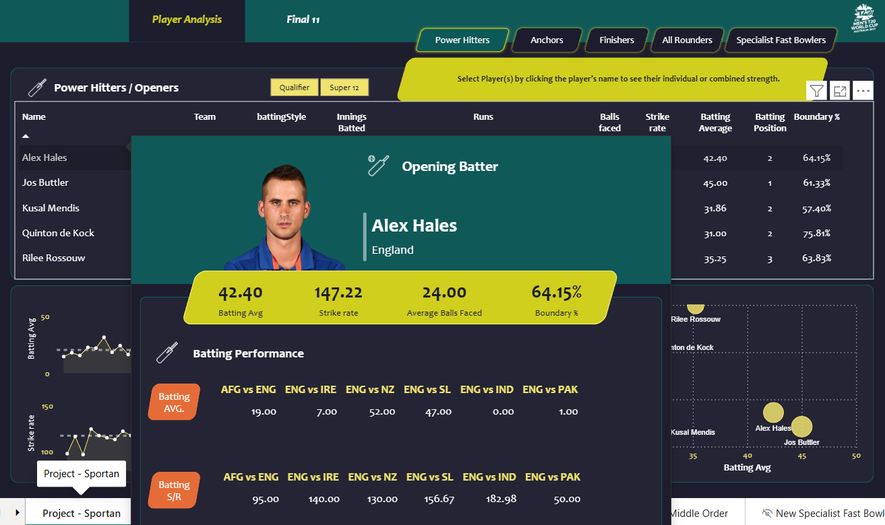
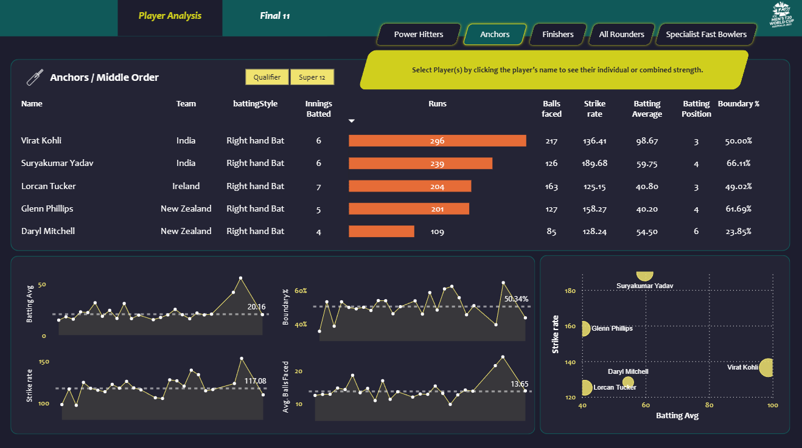
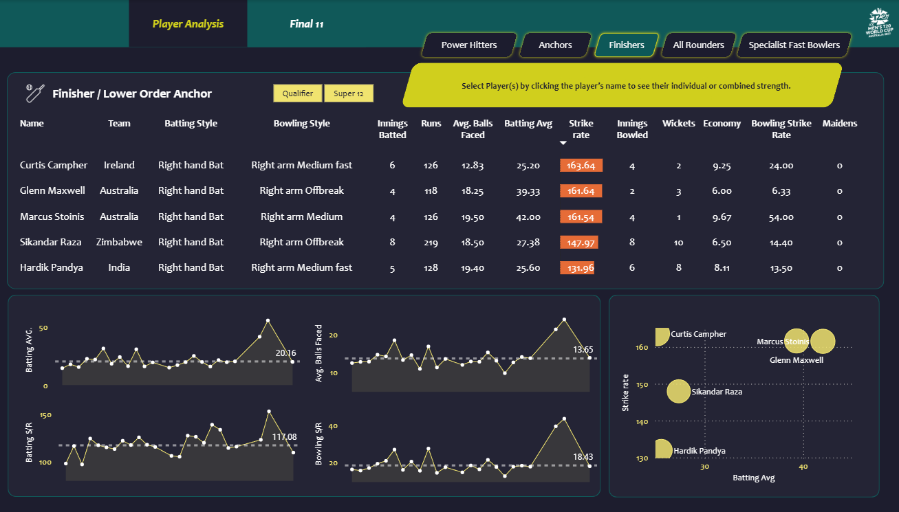
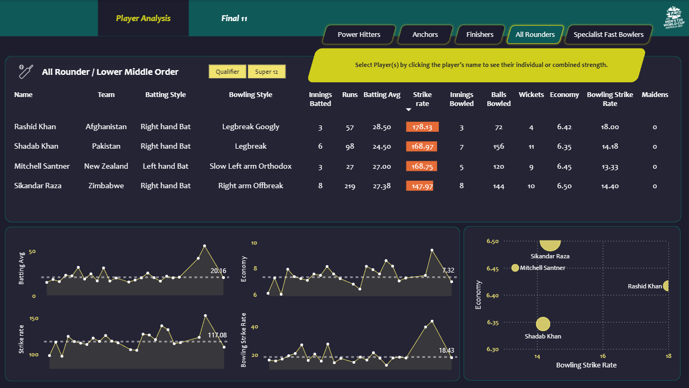
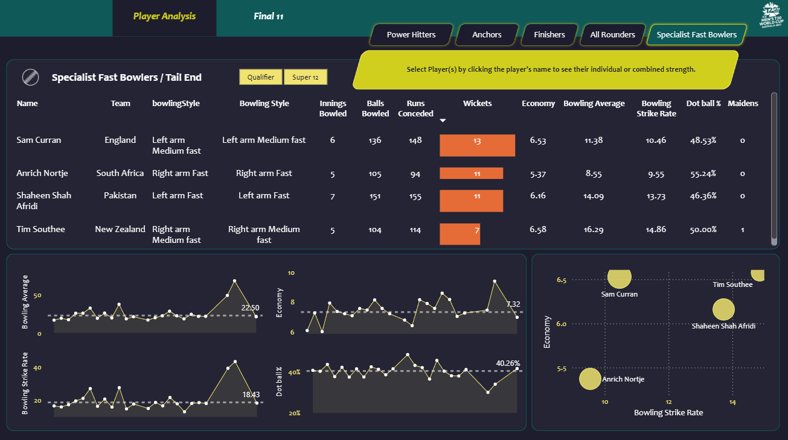

# 🏏 T20 Cricket World Cup Data Analytics Dashboard

An end-to-end cricket data analytics project built using **Python, Web Scraping, Pandas, Power BI, DAX, Excel, CSV and JSON**.

The project analyzes T20 Cricket World Cup data to provide insights into **batting performance, bowling performance, player statistics, team performance and match results** through an interactive Power BI dashboard.

---

## 📊 Dashboard Preview

### Dashboard 1


### Dashboard 2


### Dashboard 3


### Dashboard 4


### Dashboard 5


### Dashboard 6


---

## 🎯 Project Objective

The objective of this project is to collect, clean, transform and analyze T20 cricket data and build an interactive dashboard that helps users explore player and team performance.

The project covers the complete data analytics workflow:

**Web Scraping → Data Collection → Data Cleaning → Data Transformation → DAX → Power BI → Interactive Dashboard**

---

## 🛠️ Technologies Used

- **Python**
- **Pandas**
- **Web Scraping**
- **Power BI**
- **DAX**
- **Microsoft Excel**
- **CSV**
- **JSON**
- **Jupyter Notebook**

---

## 📂 Dataset

The project uses T20 cricket data stored in CSV and JSON formats.

The datasets contain information related to:

- Match results
- Batting statistics
- Bowling statistics
- Player information
- Team performance

---

## 🔄 Data Pipeline

```text
Web Scraping
      ↓
Raw Cricket Data
      ↓
CSV / JSON Files
      ↓
Data Preprocessing
      ↓
Cleaned Dataset
      ↓
Power BI
      ↓
DAX Measures
      ↓
Interactive Dashboard
